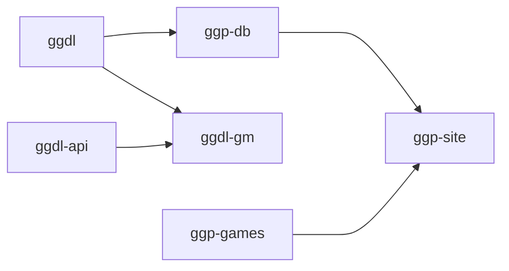

# GGDL (General Game Description Language)

In this repo are the parser and compiler implementations:

* `src/` GGDL implemented entirely in core golang, with no external dependencies.
Other repositories within this organization depend on the parsing and compiling
into a more fluent intermediate representation suitable for traversing and value
unifying on.

* `cmd/` contains tools for code generation and an interactive REPL.  These
use the golang library unless prefixed by `ts-`.  Most commands for typescript
build/test/eval are done using `npm build` or `npm install` from within `ts/`.

## GGDL and its relation to other General Game Playing environments

This project builds on work done in academia in the field of
 General Game Playing,
especially the foundational work by Stanford and GGP.org in their design of the
GDL language and holding the International General Game Playing Competition.  It
builds on that work by extending the language to simplify some relations (such
as the integers and common board/equipment templates), and by extending GDL
in ways similar to CGDL, RBG, TGDL, EGDL and the GDL-II and GDL-III extensions.

There are other systems that have tried to include as wide a range of game types
(most notably OpenSpiel and Ludii) but they are only partially implemented in a
logical representation and have a large component in a procedural language such
as C++ or Java, so an AI reading the rules has an incomplete picture of what
makes up the game definition.

This project, and the related projects for hosting a game-playing service, aim
to build fully logical definitions.  There is part of the GGDL language which
depends on an externality, and that is the user interface for gathering user
inputs and distributing move and state updates to the players.  These borrow
from concepts expressed in GDL games and in the ontology of Ludii's ludemes,
but the level of abstraction is chosen to enable the code-generation of a web
service endpoint able to (efficiently) evaluate the player moves for legality
and update the game state consistently.

Being able to code-generate the web service endpoint opens the door to also
code-generating a user guide, an AI player, even a user interface (with the help 
of some utility components provided in a platform-specific client library).

Being able to code-generate the UI means we can code-generate an accessible UI
for vision impaired or mobility impaired players, if not fully automatically
then at least fully integrated with the game playing service.  Having the API
and the game logic generated from the same logical description eliminates an
entire class of bugs frequently introduced when making manual changes to a
service API and game playing protocol and its data schema alignment.  It also
provides a sound basis for separating concerns -- GM logic and client logic and
game data schema and player data schema are clearly defined responsibilities of
individual components of the system.

## GGDL and related repositories

* **ggdl**: (this repo)
A parser and compiler for .ggd source files (GGDL's file type), a superset of
GDL and compatible with several of the language's variants.  It can compile
GGDL down to GDL-II (or, if necessary, rtGDL) and will compile to GDL-I if able.
Contains a parser/compiler for both golang and TypeScript, developed in tandem.
This repo has github actions for compiling the parser and benchmarking its parse
times for priority operations (e.g. ground relations used in player moves).

* **ggdl-api**: the common protocols and data types that all players (human and
AI), as well as game master and lobby interfaces, use to interact.  These are
defined as a separate repo because some environments do not need an entire GGDL 
compiler to play (e.g., the game clients that have been code generated from
rules).  This is not to say that clients should not depend on `ggdl`, but that
there are benefits to building clients that only need to depend on the API.
This repo has no github actions, but has hooks into build and test that check
for internal consistency.

* **ggdl-gm**: a golang service adhering to the Game Manager for hosting games.
It coordinates the simultaneous play of moves, shares game updates with players
and spectators, and validates legal play adhering to the game's rules.  Though
it depends on `ggdl/go` so that it can arbitrate any bespoke games, some of the
game rules may be a compiled into go plugins for native compilation into Go,
compiled into an intermediate notation that the service can snapshot and read
back in when play resumes.
This repo has github actions for staging the GM to be released.

* **ggp-db**: maintains the list of games, game metadata and game history for
recent matches.  Is defined in a game-agnostic way and compatible with OpenAuth
ID servers to provide ACLs across any arbitrary game definition or game state
representation.  Clients do not need to know how the metadata and replay data
are stored, only how to retrieve and parse it as described in `ggdl-api`.  This
is the reference implementation for database-related operations in the API.

* **ggp-games**: a private repository containing the game rulesets and backup
of the wiki content residing at [GGP Dojo](https://ggpdojo.com/games).  This is
the backing store for games while they are in progress and is periodically
synced with the servers running the ggpdojo site.  Game metadata will include
a `'status'` property indicating whether it should be shown in the index or only
available to beta testers, etc.
This has no github actions and is mainly a staging area for games which are not
released yet.

* **ggp-site**: web site frontend for ggpdojo.com and OAuth callback receiver.
It exposes the interface for viewing current games, creating new ones or joining
a lobby invitation.  Thus it only needs to depend on `ggdl-api` and `ggp-db`, it
is the GM's responsibility to arbitrate game logic decisions.  There is also a
dependency on `vue-client` because ggpdojo.com is a convenient location to
deploy it from, but that dependency is at deployment time, not during build.
It could be interesting to implement an SPA from within a game description... \
This repo also has the FrontEnd server's github actions for staging a release.

## Dependency structure

[nearley]: https://nearley.js.org/
